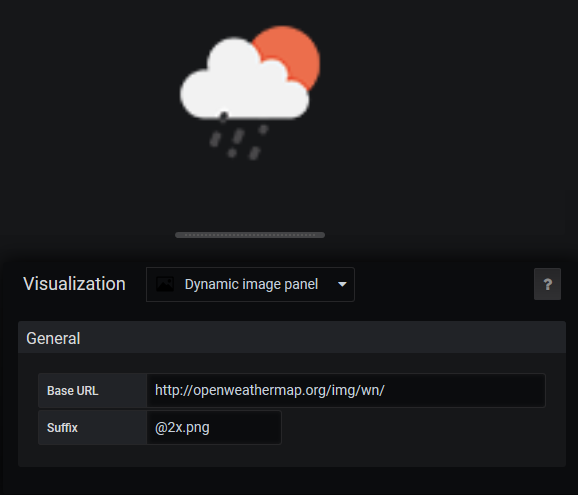

# Image
Display an image by concatenation of an URL, a metric and a suffix.  
The result will be : baseURL + metric + suffix

# Screenshot


# Build
```
yarn install
yarn build
```
Copy the content of `dist` folder into a grafana plugins subfolder called dalvany-image-panel

# Credits
Logo for the plugin was found [here](https://www.iconfinder.com/icons/211677/image_icon) and is under MIT license.
